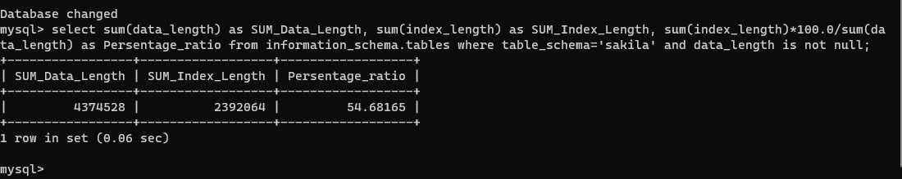
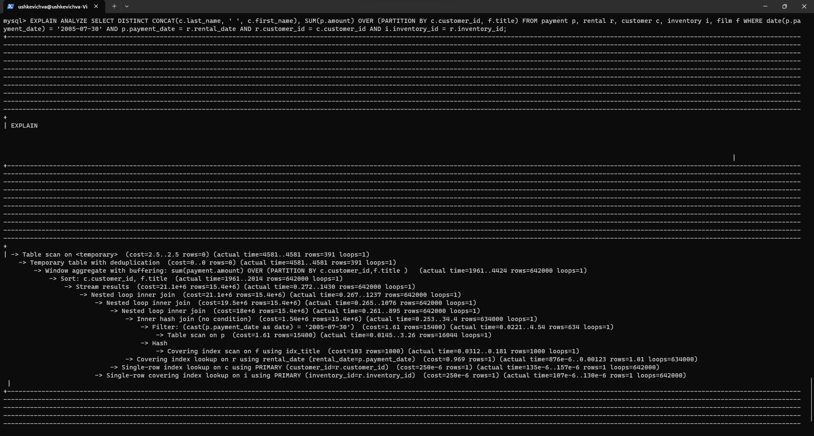
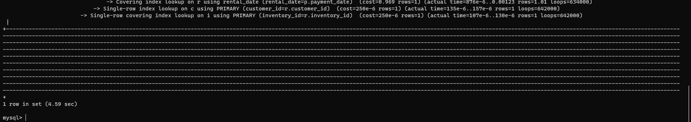
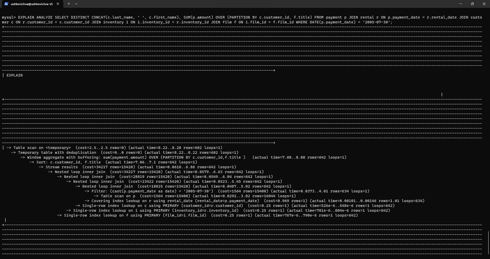
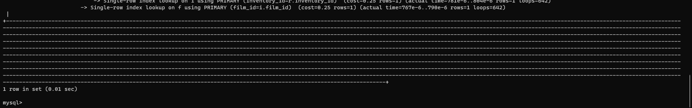
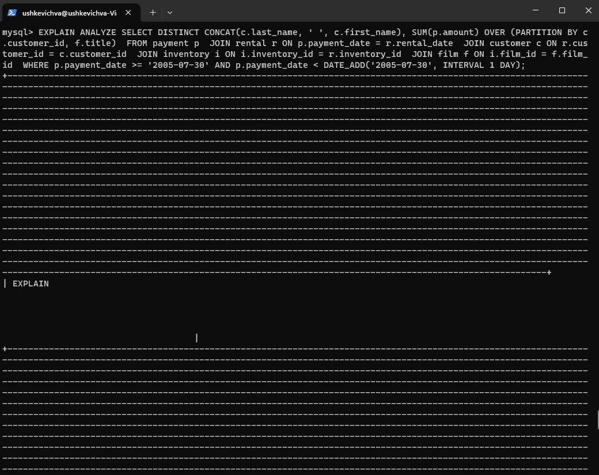
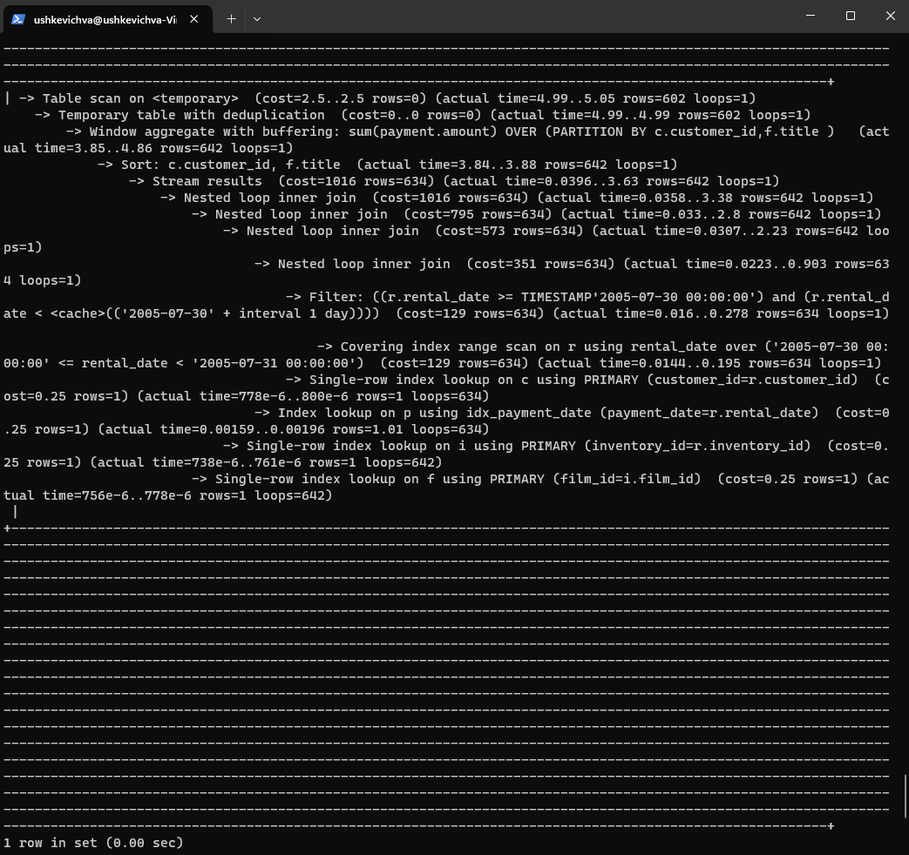

# Домашнее задание к занятию «Индексы» - `Ушкевич Всеволод`

### Инструкция по выполнению домашнего задания

   1. Сделайте `fork` данного репозитория к себе в Github и переименуйте его по названию или номеру занятия, например, https://github.com/имя-вашего-репозитория/git-hw или  https://github.com/имя-вашего-репозитория/7-1-ansible-hw).
   2. Выполните клонирование данного репозитория к себе на ПК с помощью команды `git clone`.
   3. Выполните домашнее задание и заполните у себя локально этот файл README.md:
      - впишите вверху название занятия и вашу фамилию и имя
      - в каждом задании добавьте решение в требуемом виде (текст/код/скриншоты/ссылка)
      - для корректного добавления скриншотов воспользуйтесь [инструкцией "Как вставить скриншот в шаблон с решением](https://github.com/netology-code/sys-pattern-homework/blob/main/screen-instruction.md)
      - при оформлении используйте возможности языка разметки md (коротко об этом можно посмотреть в [инструкции  по MarkDown](https://github.com/netology-code/sys-pattern-homework/blob/main/md-instruction.md))
   4. После завершения работы над домашним заданием сделайте коммит (`git commit -m "comment"`) и отправьте его на Github (`git push origin`);
   5. Для проверки домашнего задания преподавателем в личном кабинете прикрепите и отправьте ссылку на решение в виде md-файла в вашем Github.
   6. Любые вопросы по выполнению заданий спрашивайте в чате учебной группы и/или в разделе “Вопросы по заданию” в личном кабинете.

Желаем успехов в выполнении домашнего задания!

### Дополнительные материалы, которые могут быть полезны для выполнения задания

1. [Руководство по оформлению Markdown файлов](https://gist.github.com/Jekins/2bf2d0638163f1294637#Code)

---

### Задание 1

### Задание 2

##### Узкие места и оптимизация запроса
1. Table scan on <temporary>: Это узкое место указывает на сканирование временной таблицы.
2. Window aggregate with buffering: Это узкое место относится к выполнению оконной агрегации, которая используется для вычисления суммы суммарной суммы платежей по каждому customer_id и film.title.
3. Sort: Сортировка выполняется для группировки данных перед применением оконной функции. Это может быть потенциально затратной операцией, особенно при больших объемах данных.

Для оптимизации запроса можно переписать его, используя явные операторы JOIN, что обычно делает запрос более понятным и улучшает его производительность за счет использования правильного порядка объединения таблиц.

### Доработка

- Создал индекс с помощью команды CREATE INDEX idx_payment_date ON payment (payment_date);
- Переписал условие WHERE для payment_date:

'''sql
EXPLAIN ANALYZE SELECT DISTINCT CONCAT(c.last_name, ' ', c.first_name), SUM(p.amount) OVER (PARTITION BY c.customer_id, f.title) 
FROM payment p 
JOIN rental r ON p.payment_date = r.rental_date 
JOIN customer c ON r.customer_id = c.customer_id 
JOIN inventory i ON i.inventory_id = r.inventory_id 
JOIN film f ON i.film_id = f.film_id 
WHERE p.payment_date >= '2005-07-30' AND p.payment_date < DATE_ADD('2005-07-30', INTERVAL 1 DAY);
'''

Cкриншоты explain analyze после изменений:

