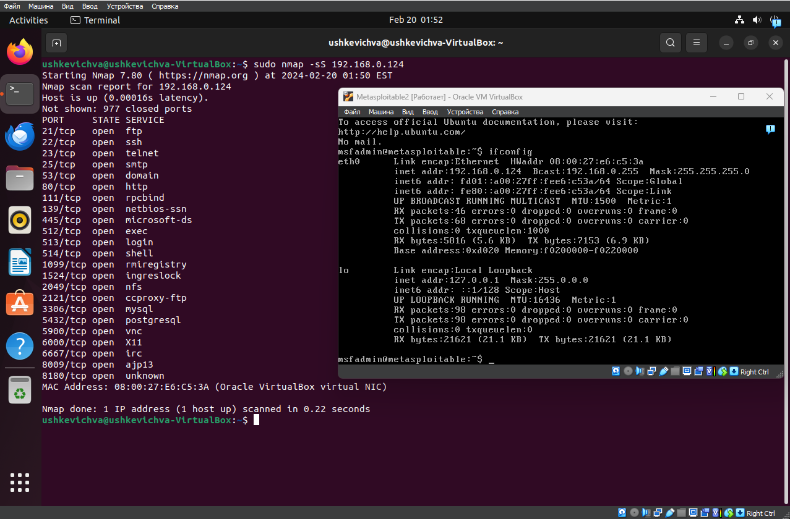
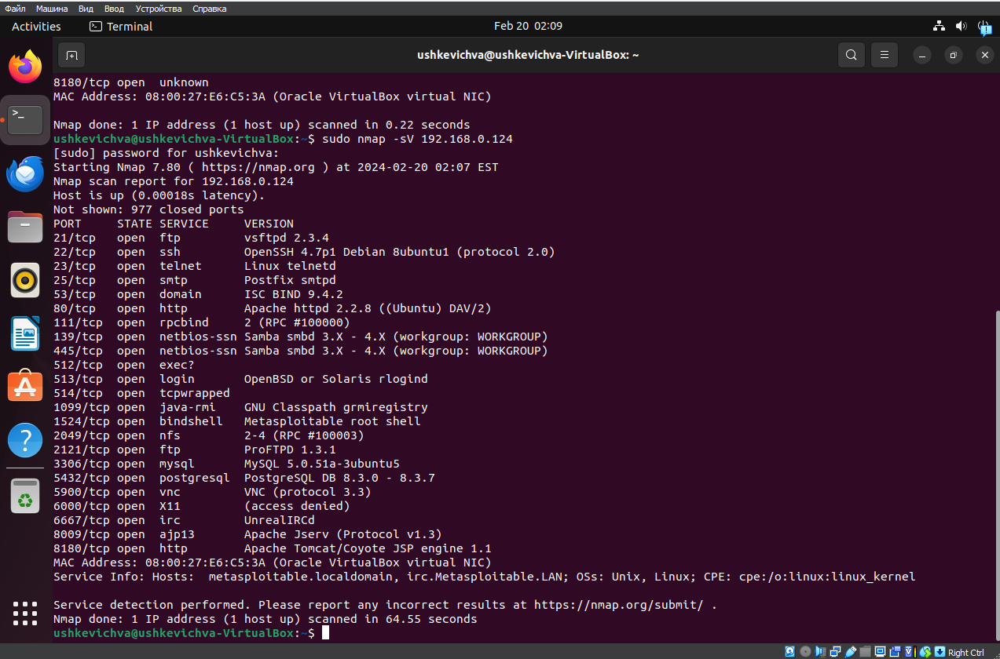

# Домашнее задание к занятию «Уязвимости и атаки на информационные системы» - `Ушкевич Всеволод`

### Инструкция по выполнению домашнего задания

   1. Сделайте `fork` данного репозитория к себе в Github и переименуйте его по названию или номеру занятия, например, https://github.com/имя-вашего-репозитория/git-hw или  https://github.com/имя-вашего-репозитория/7-1-ansible-hw).
   2. Выполните клонирование данного репозитория к себе на ПК с помощью команды `git clone`.
   3. Выполните домашнее задание и заполните у себя локально этот файл README.md:
      - впишите вверху название занятия и вашу фамилию и имя
      - в каждом задании добавьте решение в требуемом виде (текст/код/скриншоты/ссылка)
      - для корректного добавления скриншотов воспользуйтесь [инструкцией "Как вставить скриншот в шаблон с решением](https://github.com/netology-code/sys-pattern-homework/blob/main/screen-instruction.md)
      - при оформлении используйте возможности языка разметки md (коротко об этом можно посмотреть в [инструкции  по MarkDown](https://github.com/netology-code/sys-pattern-homework/blob/main/md-instruction.md))
   4. После завершения работы над домашним заданием сделайте коммит (`git commit -m "comment"`) и отправьте его на Github (`git push origin`);
   5. Для проверки домашнего задания преподавателем в личном кабинете прикрепите и отправьте ссылку на решение в виде md-файла в вашем Github.
   6. Любые вопросы по выполнению заданий спрашивайте в чате учебной группы и/или в разделе “Вопросы по заданию” в личном кабинете.

Желаем успехов в выполнении домашнего задания!

### Дополнительные материалы, которые могут быть полезны для выполнения задания

1. [Руководство по оформлению Markdown файлов](https://gist.github.com/Jekins/2bf2d0638163f1294637#Code)

---

### Задание 1

#### Список уязвимостей:

- [vsftpd 2.3.4](https://www.exploit-db.com/exploits/49757)
- [MySQL 5.0.x](https://www.exploit-db.com/exploits/30020)
- [PostgreSQL 8.2/8.3/8.4](https://www.exploit-db.com/exploits/7855)
- [ISC BIND 9](https://www.exploit-db.com/exploits/40453)

### Задание 2

#### Различия между режимами сканирования:

SYN сканирование (TCP SYN scan):

- При SYN сканировании отправляется TCP сегмент с установленным флагом SYN к серверу;
- Если порт открыт, сервер отвечает сегментом TCP с установленными флагами SYN и ACK;
- Если порт закрыт, сервер отвечает сегментом TCP с установленным только флагом RST.

FIN сканирование (TCP FIN scan):

- При FIN сканировании отправляется TCP сегмент с установленным флагом FIN к серверу;
- Если порт открыт, сервер игнорирует этот сегмент;
- Если порт закрыт, сервер отвечает сегментом TCP с установленным только флагом RST.

Xmas сканирование (TCP Xmas scan):

- При Xmas сканировании отправляются TCP сегменты с установленными флагами FIN, PSH и URG к серверу;
- Если порт открыт, сервер игнорирует эти сегменты;
- Если порт закрыт, сервер отвечает сегментом TCP с установленным только флагом RST.

UDP сканирование:

- При UDP сканировании отправляются UDP пакеты к серверу;
- Если порт открыт, сервер не отправляет никакого ответа или отправляет ICMP пакет с сообщением "Port Unreachable";
- Если порт закрыт, сервер отправляет ICMP пакет с сообщением "Port Unreachable".

#### Как отвечает сервер:

Для открытых портов сервер обычно либо устанавливает соединение, либо игнорирует запрос в зависимости от типа сканирования.
Для закрытых портов сервер обычно отправляет сегмент TCP с флагом RST (Reset) для TCP сканирования или ICMP пакет с сообщением "Port Unreachable" для UDP сканирования.
